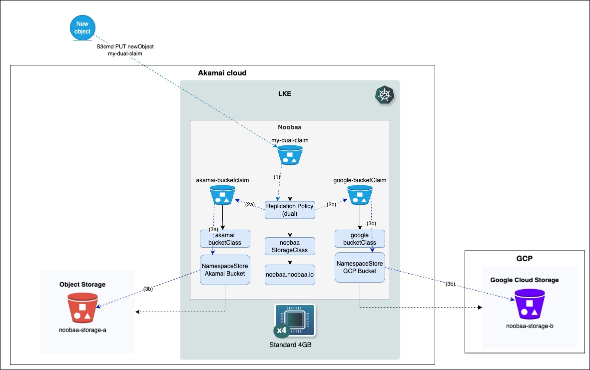

# A Cross-Cloud Storage Replication Solution with NooBaa on Akamai Cloud and Google

## Index

- [Overview & Objective](#overview-&-objective)
- [Architecture](#architecture)
- [Prerequisites](#prerequisites)
- [Infrastructure Components](#infrastructure-components)
- [Initial Deployment](#initial-deployment)
- [NooBaa Deployment and Configuration](#noobaa-deployment-and-configuration)
- [Cleanup](#cleanup)
- [Security Considerations](#security-considerations)

## Overview & Objective

This is a laboratory to demonstrate how to deploy NooBaa in a cloud-managed Kubernetes cluster and configure it as a multi-cloud storage gateway to test replication features between external object storage services. 
For this lab I've selected Akamai Cloud and Google Cloud as Cloud Providers, but few adaptations can be replicated also with other providers. The objective of this lab is to explore, define and test the basic steps needed to create a unified S3-compatible interface that acts as a proxy gateway to object storage buckets hosted on different cloud platforms to which a full data replication is enabled.

As it is further detailed below, this lab tries to replicate on a smaller and simplified scale the complex multi-cloud strategy architecture implemented by many organizations to show how open-source software can provide an abstraction layer to fully automate data replication on different platforms.

### Business Applications and Use Cases

This solution provides a fixed "immutable" S3-compliant storage interface which is backed by one or more actual object storage services to which all the data is replicated, regardless of where they are hosted in one or several cloud providers.

In this lab is tested the replication of all data (no filtering logics are set) to two different object storages so that the data gets redundant increasing the availability or reducing latency as the storage may be placed in different regions (in this case France for Akamai and Italy for GCP). Based on the observation of this test, NooBaa implements an asynchronous replication which runs every 20-30 minutes so that the consistency is eventually ensured also in case of a temporary fault of one of the object storages.

**Key Use Cases:**

1. **Unified Storage Interface**: Creation of one unique S3 interface abstracting multiple object storages, facilitating application development by eliminating the need to manage different cloud provider APIs

2. **Disaster Recovery and Multi-Region Availability**: Increase availability for disaster recovery purposes by allocating data either to multiple buckets from the same cloud provider or to buckets hosted in  different cloud providers, always using one unique endpoint, ensuring business continuity even if one cloud provider experiences outages

3. **Geographic Distribution and Latency Optimization**: A unique S3 interface through which data is automatically distributed to different regions, reducing latency for geo-dispersed applications and improving user experience globally



## Architecture

The laboratory creates a NooBaa instance running on a Kubernetes cluster (Linode LKE) that provides:

- **Unified Storage Interface**: Single S3-compatible endpoint for accessing multiple cloud storage backends
- **Multi-Cloud Gateway**: Proxies requests to Akamai Object Storage and Google Cloud Storage
- **Replication Testing**: Demonstrates data replication policies between different cloud providers
- **NamespaceStore Configuration**: Maps external storage buckets to NooBaa's unified namespace

The proposed solution can be considered as an architectural pattern for creating an S3-compatible interface that abstracts away the complexities of individual storage interfaces provided by different cloud providers hosting the actual object storage (in this case, Akamai Cloud and Google Cloud). At the same time, it provides a mechanism to automatically propagate and keep data synchronized between object storage services hosted on different cloud platforms.

> **⚠️ IMPORTANT NOTICE**: This laboratory is designed for **testing purposes only**. It is **NOT intended for production deployment**. Please ensure you understand the security implications and costs before proceeding.

### Components

1. **Kubernetes Cluster**: Linode Kubernetes Engine (LKE) hosting NooBaa
2. **NooBaa Storage Gateway**: Multi-cloud object storage interface
3. **External Storage Backends**:
   - Akamai Object Storage (`noobaa-storage-a`)
   - Google Cloud Storage (`noobaa-storage-b`)
4. **Security**: Cloud firewall restricting access to admin IP (please be aware this is a minimal solution, not suitable for production)
5. **Replication Policies**: Dual-site replication between storage backends

## Prerequisites

This lab has two distinct phases, each with specific prerequisites:

### Phase 1: Infrastructure Deployment Prerequisites

Required to execute the Terraform script and create the basic infrastructure:

**Required Accounts:**
1. **Akamai Account**: Valid account ([get $100 free credit here](https://www.linode.com/lp/free-credit-100/))
2. **Google Cloud Platform Account**: Valid account (free tier limits are sufficient for this lab)

**Required Tools:**
- [Terraform](https://www.terraform.io/downloads.html) (>= 1.0)
- [kubectl](https://kubernetes.io/docs/tasks/tools/)
- [gcloud CLI](https://cloud.google.com/sdk/docs/install) (for GCP authentication)
- [AWS CLI](https://aws.amazon.com/cli/) and [S3cmd](https://s3tools.org/s3cmd) (for testing PUT and LIST operations using the S3-compatible interface)
- [Task (Taskfile)](https://taskfile.dev/) - I selected this tool as it makes convenient the use of NooBaa CLI while keeping a sequential ordered flow of activities with clear dependencies yet flexible for the user.

**Authentication for Infrastructure Deployment:**
- **Akamai**: API token (sufficient to create LKE cluster, firewall, and object storage bucket)
- **GCP**: Use `gcloud auth application-default login` for Terraform authentication

### Phase 2: NooBaa Configuration Prerequisites

Required after infrastructure deployment to configure NooBaa with object storage access:

**Manual Credential Extraction (Post-Terraform):**
- **Akamai Object Storage**: Extract access key and secret key from Cloud Manager → add to `.env` file
- **Google Cloud Storage**: Create service account with Storage Admin role → extract JSON key → place in root directory

> ⚠️ **Important**: The Terraform script creates the storage buckets, but you must manually extract the access credentials for these buckets after deployment to complete the NooBaa configuration and run the tests.

## Infrastructure Components

This repository contains Terraform code to provision:

### 1. Kubernetes Infrastructure
- **Linode Kubernetes Engine (LKE)**: 4-node cluster (g6-standard-4 instances). Note that NooBaa provides a `--mini` configuration option that requires only 1-2 worker nodes with the smallest shared compute plan available in Akamai Cloud. However, this lab uses the full installation option of NooBaa, which requires a minimum configuration of 4 nodes with at least 4 cores and 8 GB RAM each.
- **Region**: Europe (Paris) - `fr-par`
- **Auto-scaling**: Enabled with min/max node limits

### 2. Security
- **Cloud Firewall**: Restricts access to specific admin IP addresses
- **Network Security**: Limited ingress rules for Kubernetes and application traffic
- **SSH Access**: Restricted to admin IP for troubleshooting

### 3. Object Storage
- **Akamai Object Storage**: Primary backend storage with versioning
- **Google Cloud Storage**: Secondary backend with private access and lifecycle policies

## Initial Deployment

### 1. Clone Repository
```bash
git clone <repository-url>
cd noobaa-lab
```

### 2. Configure Variables
Copy the example configuration and customize:
```bash
cp terraform/terraform.tfvars.example terraform/terraform.tfvars
```

Edit `terraform/terraform.tfvars` with your values:
```hcl
# Akamai Configuration
linode_token = "your-akamai-api-token"
admin_ip = "your.public.ip/32"
ssh_public_key = "ssh-ed25519 AAAA..."

# Infrastructure
region = "fr-par"
root_pass = "secure-root-password"

# GCP Configuration  
gcp_projectid = "your-gcp-project-id"
```

### 3. Set Up Cloud Provider Authentication

Before deploying infrastructure, you need to authenticate with both cloud providers:

#### Google Cloud Platform Setup

Authenticate using the gcloud CLI:
```bash
gcloud auth application-default login
```
Then confirm your identity on the page that opens in your browser.

#### Akamai API Token Setup

1. Log into [Akamai Cloud Manager](https://cloud.linode.com/)
2. Navigate to Account → API Tokens → Create Personal Access Token
3. Grant read/write permissions for LKE, Firewalls, and Object Storage
4. Add the token to your `terraform/terraform.tfvars` file

> 📋 **Official Documentation**: 
> - [Google Cloud Authentication](https://cloud.google.com/sdk/docs/authorizing)
> - [Linode API Tokens](https://www.linode.com/docs/products/tools/api/guides/manage-api-tokens/)

### 4. Deploy Infrastructure
```bash
cd terraform

# Initialize Terraform
terraform init

# Review planned changes
terraform plan

# Deploy infrastructure
terraform apply
```

### 5. Configure Kubernetes Access
After Terraform deployment, configure kubectl:
```bash
# Copy kubeconfig (automatically generated)
export KUBECONFIG=../.kube/config

# Verify cluster access
kubectl cluster-info
kubectl get nodes
```

### 6. Extract Object Storage Credentials (Post-Terraform deployment)

After Terraform creates the infrastructure, you need to create Object Bucket Claims (OBCs) in NooBaa that interface with both Akamai and Google storage. The corresponding secrets must be created and deployed in the NooBaa namespace.

This step could be automated by combining shell scripts with Terraform, but this lab uses manual extraction of object storage credentials for educational clarity:

**For Akamai Object Storage:**
1. Go to Akamai Cloud Manager → Object Storage
2. Find the created bucket (`noobaa-storage-a`)
3. Create access keys for the bucket
4. Copy the access key and secret key and store them in your `.env` file (use `.env.example` as a template)

**For Google Cloud Storage:**
1. Go to Google Cloud Console → IAM & Admin → Service Accounts
2. Create a service account with Storage Admin role
3. Generate and download a JSON key
4. Save as `GCS_Privatekey.json` in the root directory (use `GCS_Privatekey.json.example` as a template)

## NooBaa Deployment and Configuration

This section provides detailed instructions for deploying and configuring NooBaa using the automated Taskfile commands. The tasks are designed to be run sequentially, with automatic dependency management for core setup steps.

### Understanding the Task Structure

As already mentioned, this lab has been structured with sequential commands organized in the Taskfile in which every task is numbered according to the phase to which it belongs in order to highlight dependencies from the previous tasks. I've not used strict dependencies between tasks, so the execution can be implemented in a non-sequential order.
As final remark, it would have been possible to provide directly the .yaml files to create namespacestores, OBCs etc., but having the CLI available I think it's easier to understand the conceptual connections among the various steps.
The Taskfile is organized into 6 phases:

1. **Prerequisites (00-02)**: Install NooBaa CLI and deploy the system
2. **Credentials (03-04)**: Create secrets for cloud storage access.  
3. **NamespaceStores (05-06)**: Connect to external storage backends
4. **BucketClasses (07)**: Define storage class configurations
5. **Object Bucket Claims (08-11)**: Create storage buckets and replication
6. **Testing (12-15)**: Independent testing and validation tools

#### Phase 1: NooBaa System Setup
The aim is to install the NooBaa CLI and then deploy the NooBaa operator in LKE which extends K8s with dedicated CRDs for NooBaa.
The Operator could be installed also manually without CLI, but it would require much more operational work. The same goes for the further steps of the OBCs creation for which it is recommended to use the CLI noobaa command as the manual development of the YAML files is, in my opinion, more prone to error.

```bash
# Step 00: Install NooBaa CLI
task 00-install-noobaa-cli

# Step 01: Deploy NooBaa to Kubernetes  
task 01-deploy-noobaa

# Step 02: Verify deployment status
task 02-verify-noobaa-status
```

**What happens**: These steps install the NooBaa command-line tool, deploy the NooBaa operator and core system to your Kubernetes cluster, and verify that all components are running correctly.

#### Phase 2: Cloud Storage Credentials

```bash
# Step 03: Create Akamai Object Storage secret
task 03-create-akamai-secret

# Step 04: Create Google Cloud Storage secret  
task 04-create-google-secret
```

**What happens**: These steps create Kubernetes secrets containing your cloud storage credentials. The secrets are used by NooBaa to authenticate with external storage providers.

> ⚠️ **Prerequisites**: Ensure your `.env` file contains valid Akamai credentials and `GCS_Privatekey.json` exists with valid Google Cloud service account keys. See section 6 above.

#### Phase 3: NamespaceStore Configuration

```bash
# Step 05: Create Akamai NamespaceStore
task 05-create-akamai-namespacestore

# Step 06: Create Google Cloud NamespaceStore
task 06-create-google-namespacestore
```

**What happens**: NamespaceStores are NooBaa "custom defined resources" in K8s that encapsulate the information to connect and store data to the external object storage backends. These steps connect NooBaa to your Akamai Object Storage and Google Cloud Storage buckets.

#### Phase 4: BucketClasses and Object Bucket Claims

```bash
# Step 07: Create BucketClasses for single-cloud access
task 07-create-bucketclasses

# Step 08: Create individual Object Bucket Claims
task 08-create-single-cloud-obcs

# Step 09: Display auto-generated bucket names
task 09-display-bucket-names
```

**What happens**: BucketClasses define storage policies (single-cloud vs multi-cloud). Object Bucket Claims (OBCs) are requests for storage buckets. Step 09 shows the internal bucket names that NooBaa generates for tracking.

#### Phase 5: Multi-Cloud Replication Setup

```bash
# Step 10: Generate replication rules
task 10-generate-replication-rules

# Step 11: Create dual-cloud Object Bucket Claim
task 11-create-dual-obc
```

**What happens**: These steps create the main multi-cloud storage bucket with automatic replication between Akamai and Google Cloud. Objects uploaded to this bucket will be automatically replicated to both storage backends.

This lab uses basic replication of all files, but there are options for filtering based on prefixes. For more advanced configurations, refer to the [official documentation](https://github.com/noobaa/noobaa-core/blob/master/docs/bucket-replication.md).

### Service Exposure

NooBaa by default exposes a service named S3 from which all the OBCs defined can be queried according to the latest S3 SDK. This S3 service is a "LoadBalancer" type and thus has both internal and external IP available as in the example shown below. However, for this lab all of the scripts developed are using a port-forward on the localhost of such service so that it is easily replicable also in case of deployment on local K8s deployment.

```bash
kubectl get svc -n noobaa
NAME                      TYPE           CLUSTER-IP       EXTERNAL-IP      PORT(S)                                                    AGE
cnpg-webhook-service      ClusterIP      10.128.151.90    <none>           443/TCP                                                    10d
noobaa-db-pg-cluster-r    ClusterIP      10.128.161.243   <none>           5432/TCP                                                   10d
noobaa-db-pg-cluster-ro   ClusterIP      10.128.85.146    <none>           5432/TCP                                                   10d
noobaa-db-pg-cluster-rw   ClusterIP      10.128.46.136    <none>           5432/TCP                                                   10d
noobaa-mgmt               ClusterIP      10.128.213.211   <none>           80/TCP,443/TCP,8445/TCP,8446/TCP                           10d
noobaa-syslog             ClusterIP      10.128.6.248     <none>           514/UDP                                                    10d
s3                        LoadBalancer   10.128.240.35    172.232.48.120   80:32135/TCP,443:32695/TCP,8444:31404/TCP,7004:30847/TCP   10d
sts                       LoadBalancer   10.128.180.104   172.232.58.150   443:32157/TCP                                              10d 
```
Therefore, the options of using S3 service either via the external IP or via its port-forwarding have the same results, just remember in case of the first option to re-adapt the endpoints queried in the commands of the Taskfile from the local http://127.0.0.1:6443 to your public IP associated to S3.

```bash
# Start port forwarding (run in separate terminal)
task 12-start-port-forward

```

### Testing and Validation

The testing tasks are independent and can be run in any order after the core deployment is complete:


```bash
# Extract NooBaa S3 credentials
task 13-extract-noobaa-credentials

# Test S3 API listing
task 14-test-s3-list

# Test object upload with replication
task 15-test-s3-upload
```

**Port Forwarding**: Task 12 creates a local tunnel to the NooBaa S3 API endpoint. Keep this running in a separate terminal window during testing. Note that NooBaa also creates a Kubernetes service of type "LoadBalancer" that automatically exposes the S3 service over the internet through LKE. Instead of using port-forward on localhost, you could use the public S3 IP, but this requires modifying the attached firewall policy and also adapting the script for testing in the Taskfile.

**Credential Extraction**: Task 13 retrieves the auto-generated S3 access credentials from NooBaa and appends them to your `.env` file. This is needed because every OBC generated in Noobaa has its own access key and secret generated automatically by Noobaa.

**Testing**: Tasks 14 and 15 validate that the S3 API is working and that replication is functioning correctly.

### Verification Steps

After deployment, verify your setup:

1. **Check NooBaa Status**:
   ```bash
   noobaa status -n noobaa
   ```

2. **Verify NamespaceStores**:
   ```bash
   kubectl get namespacestores -n noobaa
   ```

3. **Check Object Bucket Claims**:
   ```bash
   kubectl get obc -n my-app
   ```

4. **Test Replication**:
   - Upload a test file using task 15. Task 15 creates a text file with a timestamp of the date and time, making it easy to check replication timing.
   - Check both Akamai Cloud Manager and Google Cloud Console
   - Verify the object appears in both locations. 

Based on my testing, replication occurs asynchronously with timing that varies from a minimum of 2-3 minutes up to 40 minutes. This aligns with NooBaa's "eventual consistency" specifications.

### Command Line Verification

The same checks can also be done using command lines:

**For Google Cloud:**
```bash
# Make sure your gcloud is pointed at the right project
gcloud config set project YOUR_PROJECT_ID

# List objects in the bucket
gcloud storage objects list gs://noobaa-storage-b
```

**For Akamai (using AWS CLI):**
```bash
AWS_ACCESS_KEY_ID=YOUR_ACCESS_KEY \
AWS_SECRET_ACCESS_KEY=YOUR_SECRET_KEY \
AWS_DEFAULT_REGION=us-ord \
aws s3 ls s3://noobaa-storage-a \
  --endpoint-url https://us-ord.linodeobjects.com
```

### Troubleshooting Common Issues

**NooBaa Pods Not Ready**:
```bash
# Check pod status
kubectl get pods -n noobaa

# View logs
kubectl logs -f deployment/noobaa-operator -n noobaa
```

**NamespaceStore Connection Issues**:
```bash
# Check NamespaceStore status
kubectl describe namespacestore akamai-ns -n noobaa
kubectl describe namespacestore gcs-ns -n noobaa
```

**Credential Problems**:
```bash
# Verify secrets exist
kubectl get secrets -n noobaa | grep -E "(akamai|gcp)"

# Check secret contents (base64 encoded)
kubectl get secret akamai-s3-cred -n noobaa -o yaml
```

### Advanced Configuration

**Custom Regions**: Modify the NamespaceStore YAML files to use different storage regions.

**Different Replication Policies**: Edit `replication-rules.json` to customize replication behavior.

**Multiple Storage Classes**: Create additional BucketClasses for different storage policies.

## Cleanup

To avoid ongoing charges, destroy the infrastructure when finished:

```bash
cd terraform

# Destroy all resources
terraform destroy

# Confirm with 'yes' when prompted
```

## Security Considerations

⚠️ **Security Reminders**:
- This setup uses basic authentication and minimal security controls
- The flows are in HTTP and not HTTPS so consider implementing it in other scenarios
- Firewall rules are restrictive but basic
- Object storage keys are stored in Terraform state
- **This configuration is only for development/laboratory environments**

---

**Remember**: This lab creates billable resources. Monitor your usage and clean up resources when finished to avoid unexpected charges.